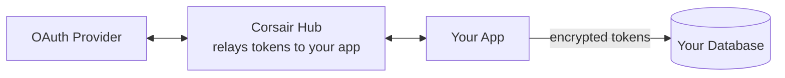

import CreateCorsairHub from '/snippets/create-corsair-hub.mdx';
import MountHandlerNextjs from '/snippets/mount-handler-nextjs.mdx';

Corsair runs in your own app. A few things, though, need a stable public URL a third party can reach: OAuth callbacks and approval pages. Hub handles them. It is a hosted relay that provides those surfaces so you skip the boilerplate.

Hub is the same `createCorsair` instance with one extra config block: add it and Corsair routes the public-URL surfaces through Hub. There is no separate product or SDK to adopt.

<CreateCorsairHub />

## Where your credentials live

Hub stores **zero** of your tenants' tokens. Their access and refresh tokens live only in **your** database, encrypted under your [KEK](/concepts/auth#envelope-encryption). What Hub keeps is the OAuth **client** credentials that run the flow, the app-level client id and secret, whether Corsair manages them for you or you bring your own. Those are your app's credentials, not your users'.

That split is the point of Hub. Once a tenant connects, the token sits in your database and you call the provider as many times as you want, with no per-call round-trip to Corsair and no usage cap from us. Other integration products keep your users' tokens on their side and meter every call through their gateway. Corsair hands you the tokens and stays out of the path.



The same envelope encryption described in [Authentication](/concepts/auth#envelope-encryption) still applies. Each connection gets its own DEK, encrypted with your KEK, and the plaintext credential lives in your database.

## What Hub provides

Three surfaces normally need a public URL. Hub hosts all three:

<CardGroup cols={2}>
  <Card title="OAuth callbacks">
    Register one callback URL with the provider. Hub holds it for both [development and production](/hub/environments). No more swapping redirect URIs between environments.
  </Card>
  <Card title="Hosted connect page">
    When an action needs a connection the user has not made yet, call `createLink()` to mint a Hub sign-in link. Hub hosts the connect page, so there is none to build. The user connects and retries.
  </Card>
  <Card title="Approval UI">
    For gated [permissions](/concepts/permissions), the SDK generates a link to a hosted approve/deny page. You do not build a review UI.
  </Card>
</CardGroup>

## Connecting an account

When an action needs a connection the user hasn't made yet, recover in four steps:

1. Corsair throws an auth-missing error. No connection exists for this tenant.
2. Call `createLink()` to mint a Hub sign-in link and send the user to it.
3. The user connects on Hub's hosted page. Tokens land encrypted in your database.
4. Retry the original action. It succeeds.

You can also copy sign-in links from the [Hub dashboard](/hub/dashboard) without writing code.

## One callback, two environments

Without Hub, the OAuth redirect URI you register with each provider has to match the environment that is running, so you end up juggling separate provider apps (or rewriting redirect URIs) for local and production.

With Hub you register **one** callback URL with the provider. Hub receives the callback and delivers the result to your app. Development and production use separate API keys and different delivery paths. See [Environments](/hub/environments) for why (signed POST over a Corsair tunnel locally, signed POST to your public URL in production).

## Turning Hub on

Set up a project in the [Hub dashboard](https://hub.corsair.dev/dashboard), then pass the `hub` block to `createCorsair`.

<Steps>
  <Step title="Create an organization and project">
    Sign in to the dashboard, create an organization, then create your first project. You get **development** and **production** environments automatically.
  </Step>
  <Step title="Copy development credentials">
    Open the **Keys** tab (development environment). Add the API key and signing secret to your local env. Use development keys locally; switch to production keys when you deploy.

    ```bash .env.local
    CORSAIR_API_KEY=ck_dev_...
    CORSAIR_SIGNING_SECRET=...
    CORSAIR_KEK=...
    ```
  </Step>
  <Step title="Register the OAuth redirect URL (BYO plugins)">
    For plugins where you bring your own OAuth app, register `https://auth.corsair.dev/oauth/callback` in each provider console (GitHub, Google, etc.). This is the single callback Hub holds for every environment. Managed plugins skip this step; Corsair hosts the OAuth app.
  </Step>
  <Step title="Mount the handler and run locally">
    Mount `toNextJsHandler` at `/api/corsair`. In development, Hub auto-detects your localhost delivery URL, so no dashboard registration is needed.
  </Step>
  <Step title="Activate production when you deploy">
    Switch to the **production** environment in the dashboard, register your public HTTPS delivery URL, and set `ck_prod_…` credentials in your deployed env. See [Environments](/hub/environments).
  </Step>
</Steps>

The `hub` block carries two required fields:

| Field | Purpose |
| ----- | ------- |
| `projectApiKey` | Identifies your project and environment (`ck_dev_…` or `ck_prod_…`) |
| `signingSecret` | Verifies signed deliveries so only your app accepts them |

Optional: `apiUrl` (self-hosted Hub API), `oauthCallbackUrl` (override callback URL).

Mount the handler once and it serves both Hub delivery and the [management API](/management/overview):

<MountHandlerNextjs />

From there, minting a connect link is one API call. See [Connect / OAuth](/management/connect) for the reference.

## Why Hub

Hub saves you from building and hosting connect pages, approval UIs, and per-environment OAuth callbacks. One provider callback covers local development and production.

<Info>
Hub does not change how your agents call APIs. `corsair.slack.api.*`, `withTenant`, hooks, and the database layer all behave the same. Hub only affects the public-URL surfaces.
</Info>

## What's next

<CardGroup cols={2}>
  <Card title="Environments" href="/hub/environments">
    Development vs production keys and delivery.
  </Card>
  <Card title="Hub dashboard" href="/hub/dashboard">
    Connections, sign-in links, and production activation.
  </Card>
  <Card title="Delivery URLs" href="/hub/delivery-urls">
    Tunnel vs public-URL signed POST delivery.
  </Card>
</CardGroup>
