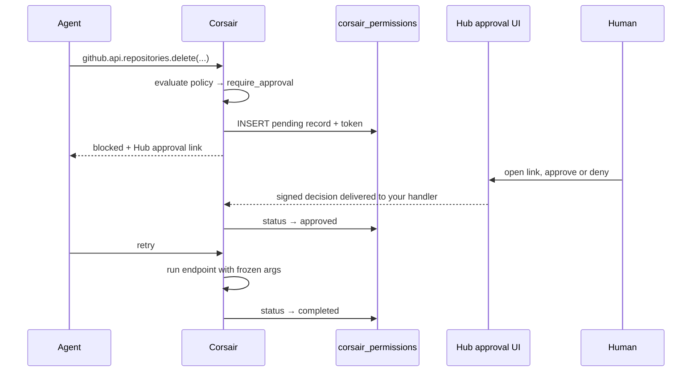

[Permissions](/concepts/permissions) gate risky agent actions behind human approval. The policy engine, the modes, and the `corsair_permissions` table work the same on Hub. Hub hosts the approve/deny UI, so you do not build a review page.

## How it works on Hub



The authoritative approval record lives in **your** `corsair_permissions` table. Hub renders the UI and delivers the signed decision to your handler, which writes the outcome to your database. Hub never touches your database. To render the review screen and route the decision, Hub does keep a short-lived session of its own holding the plugin, endpoint, the call arguments shown for review, and the tenant id, until the request is decided or expires. Delivery uses the same [environment-specific transport](/hub/delivery-urls) as connect flows: a signed POST over the Corsair tunnel in development, a signed POST to your public URL in production.

## Configuration

With `hub` configured, blocked calls include a hosted approval URL with no extra setup:

```ts corsair.ts
export const corsair = createCorsair({
    plugins: [
        github({
            permissions: {
                mode: "cautious",
                overrides: { "repositories.delete": "deny" },
            },
        }),
    ],
    database: db,
    kek: process.env.CORSAIR_KEK!,
    permissions: {
        timeout: "1h",
        onTimeout: "deny",
        mode: "asynchronous",
    },
    hub: {
        projectApiKey: process.env.CORSAIR_API_KEY!,
        signingSecret: process.env.CORSAIR_SIGNING_SECRET!,
    },
});
```

<Info>
Approvals require the `corsair_permissions` table. That table is your system of record; Hub only holds the pending session while the review is open. See [Permissions](/concepts/permissions#add-the-permissions-table) for the migration.
</Info>

## What's next

<CardGroup cols={2}>
  <Card title="Permissions" href="/concepts/permissions">
    Policies, modes, overrides, and the full approval lifecycle.
  </Card>
  <Card title="Hub overview" href="/hub/overview">
    The relay model and the surfaces Hub hosts.
  </Card>
  <Card title="MCP adapters" href="/mcp-adapters/mcp-adapters">
    How approvals gate agent tool calls.
  </Card>
</CardGroup>
